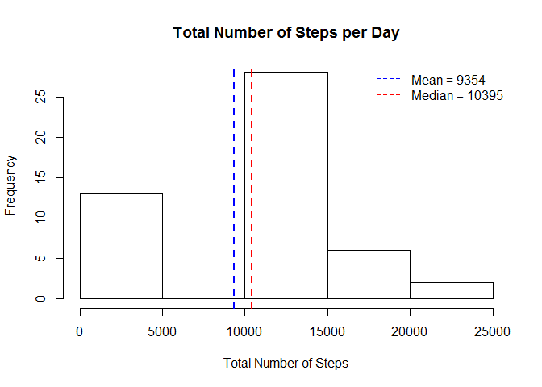
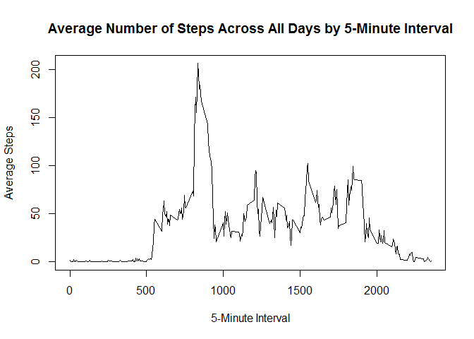
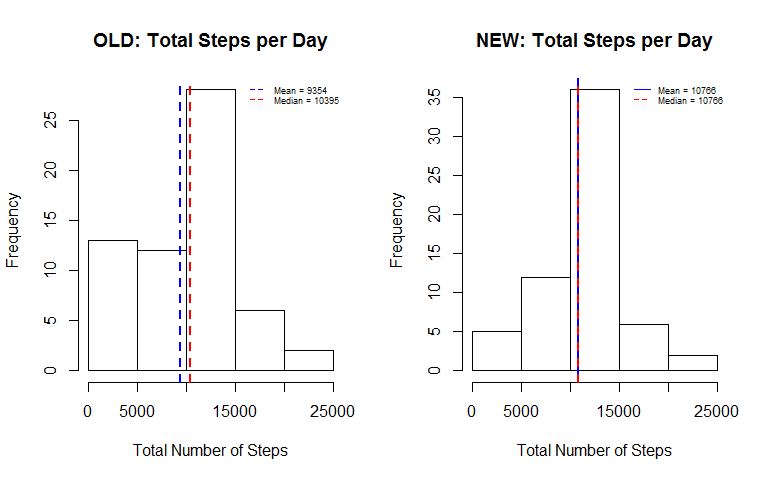
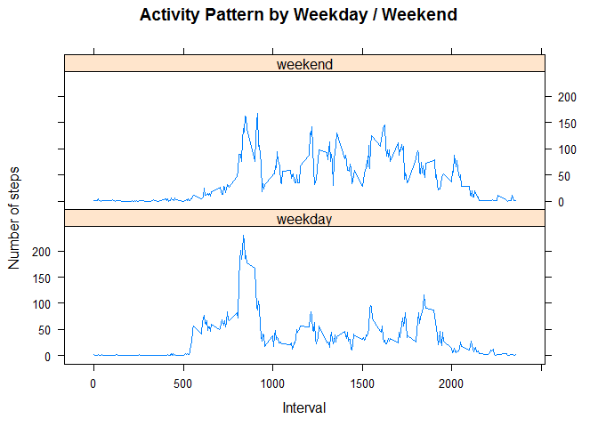

## 1. Load and preprocess data


### 1.1 Load data

```r
# Read in data from csv file
    activity <- read.csv("activity.csv", header = TRUE, na.strings = "NA", stringsAsFactors = FALSE)
```


### 1.2 Process data

```r
# Process to convert character date and date form
    activity$date <- as.Date(activity$date)
```


## 2. Mean total number of steps taken per day


### 2.1 Calculate and report mean, median steps taken per day


```r
# Build dataframe with total number of steps per day
    stepsperday <- data.frame(date = unique(activity$date), totalsteps = tapply(activity$steps, activity$date, sum, na.rm = TRUE))

# Vector-ize the totalsteps field
    stepsperday$totalsteps <- as.numeric(stepsperday$totalsteps)

# Calculate and report mean and median steps
    meansteps <- mean(stepsperday$totalsteps)
    print(paste("Mean steps =", round(meansteps,0), sep = " "))
```

```
## [1] "Mean steps = 9354"
```

```r
    mediansteps <- median(stepsperday$totalsteps)
    print(paste("Median steps =", round(mediansteps,0), sep = " "))
```

```
## [1] "Median steps = 10395"
```

### 2.2 Plot total number of steps per day histogram


```r
# Drawing histogram
    lgdMean <- paste("Mean =", round(meansteps,0), sep = " ")
    lgdMedian <- paste("Median =", round(mediansteps,0), sep = " ")
   
    hist(stepsperday$totalsteps, xlab = "", main = "")
    title(main = "Total Number of Steps per Day", xlab = "Total Number of Steps")
    
    abline(v = meansteps, col = "blue", lty = 2, lwd = 2)
    abline(v = mediansteps, col = "red", lty = 2, lwd = 2)
    
    legend("topright", bty = "n", lty = 2, col = c("blue", "red"), legend = c(lgdMean, lgdMedian))
```

<!-- -->

The above graph is stored as stepshistogram-1.png in the figure directory


## 3. Average daily activity pattern

### 3.1 Plot time series activity


```r
# Build dataframe with interval and steps by interval averaged across all days
    avgstepsperday <- data.frame(interval = unique(activity$interval), avgsteps = tapply(activity$steps, activity$interval, mean, na.rm = TRUE))


# Plot time series graph
    with(avgstepsperday, plot(x = interval, y = avgsteps, type = "l", xlab = "", ylab = ""))
    title(xlab = "5-Minute Interval", ylab = "Average Steps")
    title(main = "Average Number of Steps Across All Days by 5-Minute Interval")
```

<!-- -->

The above graph is stored as avgdailysteps-1.png in the figure directory


### 3.2 Report interval with highest activity


```r
# Most active interval
    maxstep <- avgstepsperday[which.max(avgstepsperday$avgsteps), "avgsteps"]
    
    maxstepinterval <- avgstepsperday[which.max(avgstepsperday$avgsteps), "interval"]
    
    print(paste("Across all days, the ",maxstepinterval,"th interval shows highest average number of steps, i.e. ", round(maxstep,0), " steps.", sep = ""))
```

```
## [1] "Across all days, the 835th interval shows highest average number of steps, i.e. 206 steps."
```

## 4. Impute missing values

### 4.1 Report number of missing values

```r
# Report total number of missing values in the dataset, coded as NA
    nullRows <- table(is.na(activity$steps) == TRUE)

    print(paste("The number of rows with missing values are:", nullRows["TRUE"], sep = " "))
```

```
## [1] "The number of rows with missing values are: 2304"
```

### 4.2 Fill missing values, create new dataset


```r
# Strategy to impute = mean for that 5-minute interval, averaged over all days
    avgstepsperinterval <- data.frame(interval = unique(activity$interval), avgsteps = tapply(activity$steps, activity$interval, mean, na.rm = TRUE))

# Make new dataset "activityfilled" by replacing nulls in old dataset "activity" with mean step values per interval from "avgstepsperinterval"
    activityfilled <- activity
    numRow <- nrow(activityfilled)
    i = 1

    while(i <= numRow){
        ifelse(is.na(activityfilled[i,"steps"]), activityfilled[i,"steps"] <- avgstepsperinterval[avgstepsperinterval$interval == activityfilled[i,"interval"] ,"avgsteps"], TRUE)
        
        i = i + 1
    }
    
    print("From oringal dataset 'activity', we created a new dataset 'activityfilled', which has no missing steps measurements. Our strategy to impute missing values used mean steps value for that 5-minute interval, averaged over all days.")
```

```
## [1] "From oringal dataset 'activity', we created a new dataset 'activityfilled', which has no missing steps measurements. Our strategy to impute missing values used mean steps value for that 5-minute interval, averaged over all days."
```

```r
    print(paste("'activityfilled' returns", any(is.na(activityfilled$steps)), "for a null check.", sep = " "))
```

```
## [1] "'activityfilled' returns FALSE for a null check."
```


### 4.3 Report new mean, median from dataset with imputed values


```r
# Build new dataframe with total number of steps per day
    stepsperdayNew <- data.frame(date = unique(activityfilled$date), totalsteps = tapply(activityfilled$steps, activityfilled$date, sum))

# Vector-ize the totalsteps field
    stepsperdayNew$totalsteps <- as.numeric(stepsperdayNew$totalsteps)

# Calculate and report new mean and median steps
    meanstepsNew <- mean(stepsperdayNew$totalsteps)
    print(paste("New mean steps =", round(meanstepsNew,0), "vs. old mean steps =", round(meansteps,0), sep = " "))
```

```
## [1] "New mean steps = 10766 vs. old mean steps = 9354"
```

```r
    medianstepsNew <- median(stepsperdayNew$totalsteps)
    print(paste("New median steps =", round(medianstepsNew,0), "vs. old median steps =", round(mediansteps,0), sep = " "))
```

```
## [1] "New median steps = 10766 vs. old median steps = 10395"
```


### 4.4 New histogram with imputed values


```r
par(mfrow = c(1,2))

# First, the old histogram for comparison
    lgdMean <- paste("Mean =", round(meansteps,0), sep = " ")
    lgdMedian <- paste("Median =", round(mediansteps,0), sep = " ")
   
    hist(stepsperday$totalsteps, xlab = "", main = "")
    title(main = "OLD: Total Steps per Day", xlab = "Total Number of Steps")
    
    abline(v = meansteps, col = "blue", lty = 2, lwd = 2)
    abline(v = mediansteps, col = "red", lty = 2, lwd = 2)
    
    legend("topright", bty = "n", lty = 2, col = c("blue", "red"), legend = c(lgdMean, lgdMedian), cex = 0.55)
    
    
# Now, the new histogram
    lgdMeanNew <- paste("Mean =", round(meanstepsNew,0), sep = " ")
    lgdMedianNew <- paste("Median =", round(medianstepsNew,0), sep = " ")
   
    hist(stepsperdayNew$totalsteps, xlab = "", main = "")
    title(main = "NEW: Total Steps per Day", xlab = "Total Number of Steps")
    
    abline(v = meanstepsNew, col = "blue", lty = 1, lwd = 2)
    abline(v = medianstepsNew, col = "red", lty = 2, lwd = 2)
    
    legend("topright", bty = "n", lty = c(1,2), col = c("blue", "red"), legend = c(lgdMeanNew, lgdMedianNew), cex = 0.55)
```

<!-- -->

The above graph is stored as stepshistogramNew-1.png in the figure directory. 
  
We observe a change in the shape of the graphs based on the old and new data.  
There is a marked increase in the values of both mean and median, based on the new data vs. the old data. 
  
  
## 5. Differences in activity patterns between weekdays and weekends

### 5.1 Add new variable by type of day, create dataset for new plot

```r
# Add a field to dataset with filled-in missing values
    activityfilled$daytype <- ifelse(weekdays(activityfilled$date) %in% c("Monday", "Tuesday", "Wednesday", "Thursday", "Friday"), "weekday", "weekend")

# Factor-ize that field
    activityfilled$daytype <- as.factor(activityfilled$daytype)
    
# Demonstrate modified dataset
    str(activityfilled)
```

```
## 'data.frame':	17568 obs. of  4 variables:
##  $ steps   : num  1.717 0.3396 0.1321 0.1509 0.0755 ...
##  $ date    : Date, format: "2012-10-01" "2012-10-01" ...
##  $ interval: int  0 5 10 15 20 25 30 35 40 45 ...
##  $ daytype : Factor w/ 2 levels "weekday","weekend": 1 1 1 1 1 1 1 1 1 1 ...
```

```r
# Create new dataset with mean steps by interval by type of day
    plotdata <- data.frame(interval = unique(activityfilled$interval), avgsteps = tapply(activityfilled$steps, list(activityfilled$interval, activityfilled$daytype), mean))

plotdata.weekday <- plotdata[,c("interval", "avgsteps.weekday")]
names(plotdata.weekday)[2] <- "avgsteps"
plotdata.weekday$daytype <- "weekday"

plotdata.weekend <- plotdata[,c("interval", "avgsteps.weekend")]
names(plotdata.weekend)[2] <- "avgsteps"
plotdata.weekend$daytype <- "weekend"

plotdata <- rbind(plotdata.weekday, plotdata.weekend)
```


### 5.2 Create time series plot of activity by type of day (weekday/weekend)


```r
# Assuming lattice package is installed
library(lattice)

# Plot average number of steps by interval and type of day
xyplot(data = plotdata, avgsteps ~ interval | daytype, layout = c(1,2), type = "l", xlab = "Interval", ylab = "Number of steps", main = "Activity Pattern by Weekday / Weekend")
```

<!-- -->

The above graph is stored as daytypeactivityplot-1.png in the figure directory.
